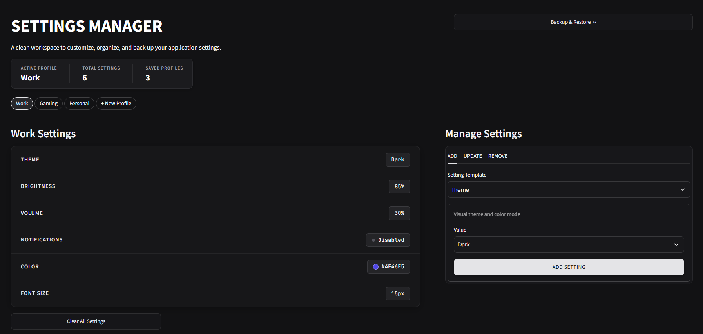

# Settings Manager

A clean, responsive dashboard to customize, organize, and back up application settings in real-time. Built with Python and Streamlit, featuring multi-profile switching, type-aware controls, and client-side JSON persistence.

## Preview



**🔗 [View Live Application](https://settings-manager.streamlit.app/)**

## Core Features

- **Multi-Profile Management:** Create, switch, and delete isolated profiles (*Work*, *Gaming*, *Personal*) with instant visual state updates.
- **Type-Aware Settings Controls:** Automatically selects the right input widget—sliders, toggles, color pickers, or text fields—based on setting type.
- **Client-Side Persistence:** Export settings to a local JSON file and import backups with automated schema validation and error handling (supports single profiles or complete bundles).
- **Full CRUD Lifecycle:** Create, inspect, update, and remove settings with immediate visual feedback.

## Technical Overview

The application provides a self-contained environment for managing application settings without external database dependencies. It is built on a modular architecture that separates data serialization and validation (`utils.py`) from presentation and state orchestration (`app.py`), and is backed by a continuous integration pipeline (GitHub Actions) running automated unit tests via Pytest.

## UI & Design

- **Focused Design System:** A clean monochrome theme with elevated cards and clear visual hierarchy provides a distraction-free, readable interface.
- **Dual Typography & Alignment:** Combines Plus Jakarta Sans for interface labels with JetBrains Mono for values, adapting seamlessly across mobile and desktop devices.

## Tech Stack

- **Language:** Python
- **Framework:** Streamlit
- **Testing & CI:** Pytest, GitHub Actions
- **Styling:** Custom CSS3 (Plus Jakarta Sans, JetBrains Mono)
- **Data Format:** JSON (Client-Side)

## Running it Locally

1. Ensure you have Python installed on your system.

2. Clone the repository:

   ```bash
   git clone https://github.com/jatinpanigrahy/settings-manager.git
   cd settings-manager
   ```

3. Activate your virtual environment (e.g., `.venv`):

   ```bash
   python -m venv .venv
   # Windows (PowerShell):
   .\.venv\Scripts\Activate.ps1
   # macOS/Linux:
   source .venv/bin/activate
   ```

4. Install the required dependencies:

   ```bash
   pip install -r requirements.txt
   ```

5. Run tests:

   ```bash
   python -m pytest
   ```

6. Launch the application:

   ```bash
   streamlit run app.py
   ```

## Deployment

This application is deployed and hosted via Streamlit Community Cloud.

**Live Application:** <https://settings-manager.streamlit.app/>
